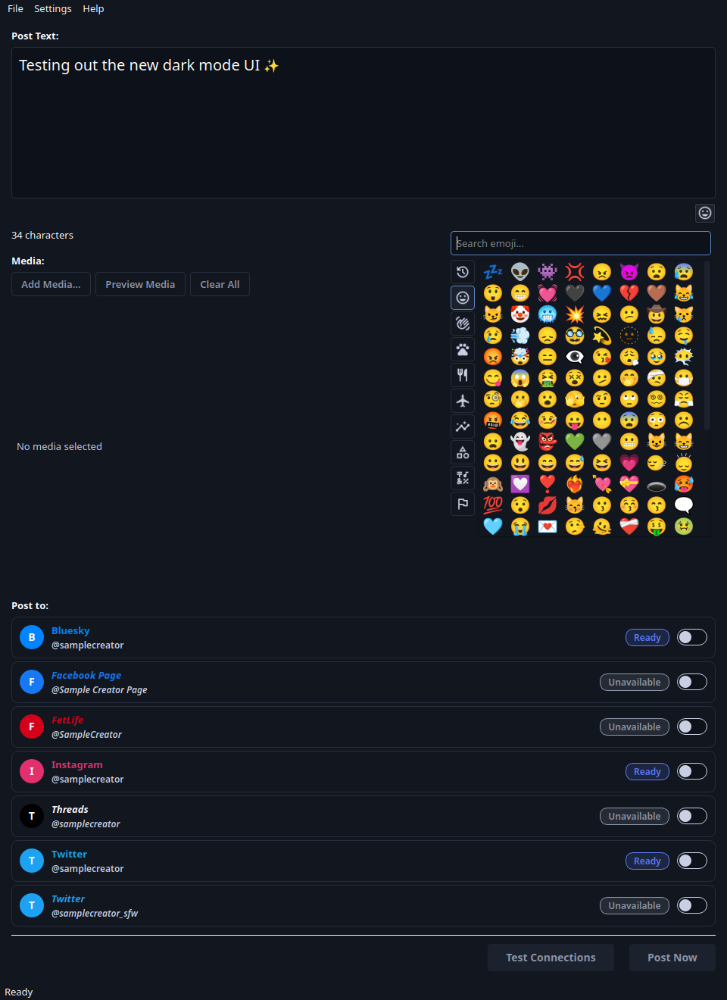
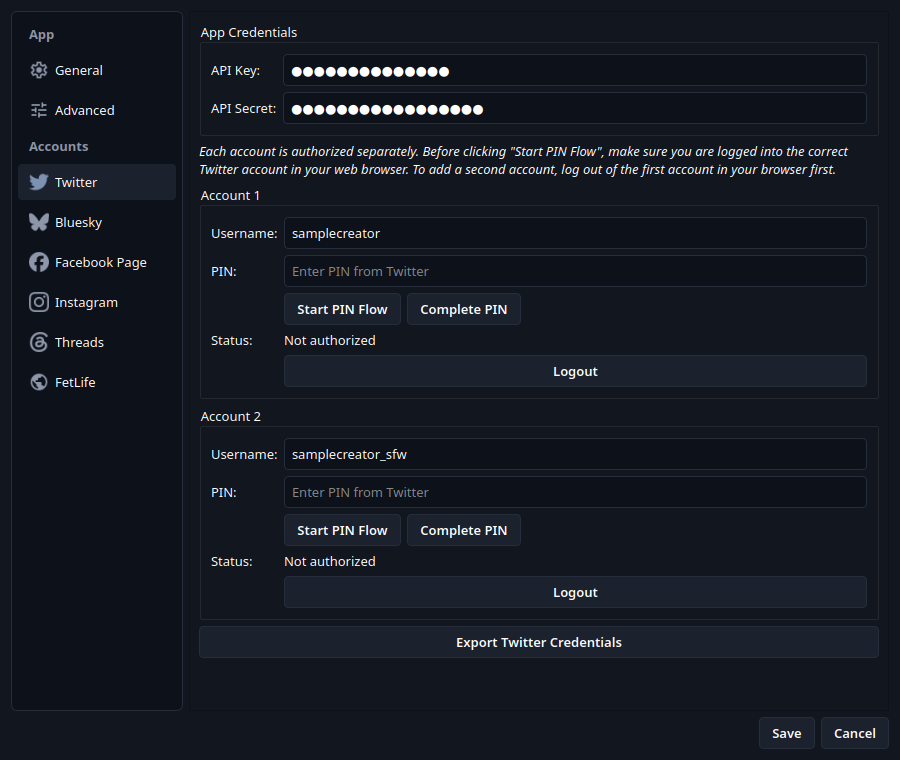
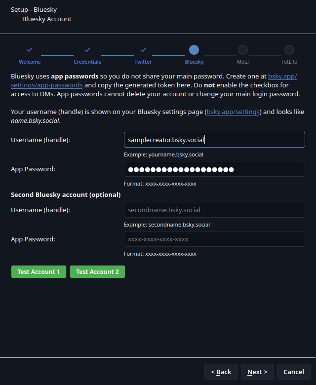
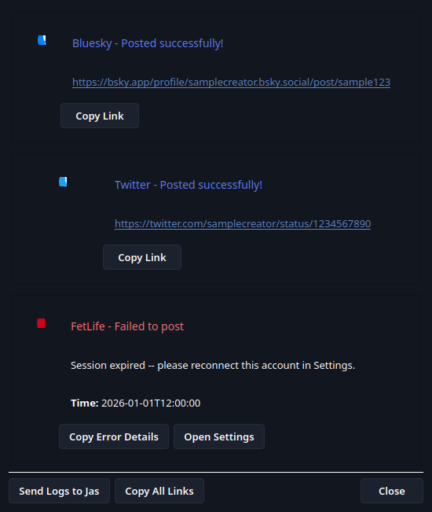

# GaleFling


GaleFling is a desktop app for posting to multiple social platforms at once, packaged for Windows and Linux. It’s designed for non-technical creators, with clear guidance, robust error handling, and one-click log sharing for support.

**Current Version:** 1.8.15

Docs: [Changelog](CHANGELOG.md) | [Roadmap](docs/ROADMAP.md) | [Contributing](docs/CONTRIBUTING.md) | [Twitter Setup](docs/platforms/TWITTER.md) | [Instagram Setup](docs/platforms/INSTAGRAM.md)

## Download & Install

Grab the latest package from the [GitHub Releases page](https://github.com/jasmeralia/GaleFling/releases).

- **Windows 10/11:** Run `GaleFling-Setup-<version>.exe`.
- **Debian/Ubuntu (amd64 or arm64):** `sudo apt install ./GaleFling-<version>-<arch>.deb`
- **Fedora/RHEL (amd64 or arm64):** `sudo dnf install ./GaleFling-<version>-<arch>.rpm`
- **AppImage (amd64 or arm64):** `chmod +x GaleFling-<version>-<arch>.AppImage`, then run it with `./GaleFling-<version>-<arch>.AppImage`.
- **Snap (amd64 or arm64):** `sudo snap install --classic --dangerous ./GaleFling-<version>-<arch>.snap`

Linux packages are sideloaded from GitHub Releases. See [Linux Packaging](docs/BUILD_AND_RELEASE.md#linux-packaging) for the glibc baseline and Snap confinement details.

## First-Time Setup

On first launch, the app walks you through adding credentials for each platform. Only platforms with valid credentials are enabled.

### Platform-Specific Guides

- **[Twitter Setup](docs/platforms/TWITTER.md)** — Developer portal setup, API keys, and PIN-based OAuth flow (up to 2 accounts).
- **[Meta platforms (API)](docs/platforms/META_APPS.md)** — OAuth connect for [Threads](docs/platforms/THREADS.md), [Instagram](docs/platforms/INSTAGRAM.md), and [Facebook Page](docs/platforms/FACEBOOK.md). Image and video posts for Threads and Instagram are staged to S3 first.
- **[Bluesky Setup](docs/platforms/BLUESKY.md)** — Enter your handle and an app password (create one at [bsky.app/settings/app-passwords](https://bsky.app/settings/app-passwords)). Supports up to 2 accounts.
- **WebView platforms** — Log in via the embedded browser during setup. Session cookies are stored locally: [FetLife](docs/platforms/FETLIFE.md). Snapchat, OnlyFans, and Fansly are currently paused (not offered in the app) — see their docs ([Snapchat](docs/platforms/SNAPCHAT.md), [OnlyFans](docs/platforms/ONLYFANS.md), [Fansly](docs/platforms/FANSLY.md)) for why.

## Using GaleFling

- Write your post text and optionally attach media (images or video).
- Select the platforms you want to post to.
- Click **Post Now** to publish to all enabled platforms.

### Media Support

GaleFling handles images and videos with automatic per-platform processing:

- **Images:** JPEG, PNG, GIF (animated), WEBP, BMP — resized and compressed to fit each platform's limits.
- **Videos:** MP4, MOV, AVI, MKV, WEBM — resized, trimmed, and re-encoded (H.264 + AAC) as needed.
- **Automatic format conversion:** Static images are converted to a platform-supported format when needed (for example, WEBP can be converted to PNG/JPEG automatically).
- **Format restrictions:** Platforms are only disabled when automatic conversion is not possible (for example, animated GIF support remains platform-specific).
- **Video-only platforms:** Snapchat stories support video uploads. Static image attachments are auto-converted to MP4, and for multiple images you can choose `Use first image only` or `Create slideshow video` in the composer.
- **Snapchat framing controls:** For Snapchat media that needs portrait reframing, choose `Crop to vertical` or `Rotate to vertical` in the composer.
- **Text warnings:** Platforms that don't support text (e.g., Snapchat) show a warning if you've entered text.
- **Preview:** Click "Preview Media" to see how your image or video will look on each platform after processing.

### Posts Are Never Paywalled

GaleFling publishes the same post to every platform you select, and most of them — Twitter, Instagram, Bluesky — have no paywall at all. Gating that post behind a subscription on one platform would leave your audiences seeing different things, so GaleFling never does it.

Where a platform offers those controls, GaleFling sets them for open access:

- **Fansly** *(currently paused, see above)*: media uploads do *not* require a subscription. "Require Follow" is set instead, so the post reaches followers without a paywall.
- **OnlyFans** *(currently paused, see above)*: posts are never pay-per-view.

If you want to publish paywalled content, post it directly on that platform rather than through GaleFling.

## Updates

GaleFling checks for updates on startup (configurable).  
If you want beta builds, enable **Settings → Advanced Settings → Enable beta updates**.

## Troubleshooting

If something goes wrong, use **Help → Send Logs to Jas**. This bundles logs and screenshots for troubleshooting, along with your detected ffmpeg binary version.
For WebView login debugging, use **Settings → (WebView platform tab) → Export ... Cookies** to inspect stored browser cookies.
You can also quickly open the local logs folder via **Help → Open Log Directory**.

## Screenshots

All accounts shown below are fake sample data — no real usernames or IDs.

### Main window

Compose once, post to every connected account. The emoji picker is open here;
the account list shows one account per supported service, plus a second
Twitter account to demonstrate multi-account support per platform.



### Settings

Manage app credentials and per-platform accounts, including multiple accounts
for platforms that support them (Twitter shown here).



### Setup wizard

A guided first-run wizard walks through connecting each platform. See
[docs/SETUP_WIZARD.md](docs/SETUP_WIZARD.md) for a full step-by-step
walkthrough with a screenshot of every step.



### Post results

After posting, see per-platform results with direct links to each post.



## Trademark Notice

GaleFling is not sponsored by, endorsed by, or affiliated with any of the platforms it posts to. All trademarks are the property of their respective owners.

## For Developers

Development docs are in `docs/CONTRIBUTING.md`.

### Windows WebView Test VM

The reusable libvirt/KVM harness for the Windows 11 functional-test VM lives in
[`tools/windows-vm/`](tools/windows-vm/README.md). Copy `vm.env.example` to the
gitignored `vm.env` and configure local paths there. Keep the actual SSH keypair in
`~/.ssh`; `vm.env` stores only its private/public key paths.

The harness can perform a fresh unattended installation or manage an existing VM:

```bash
tools/windows-vm/create-vm.sh
tools/windows-vm/start-vm.sh
tools/windows-vm/stop-vm.sh
tools/windows-vm/snapshot-vm.sh list
tools/windows-vm/snapshot-vm.sh revert clean-loggedout
```

Windows keys, passwords, ISOs, installers, generated answer files, and VM disks
must remain outside the repository. See the harness README for prerequisites,
configuration, safety behavior, and snapshot commands.
