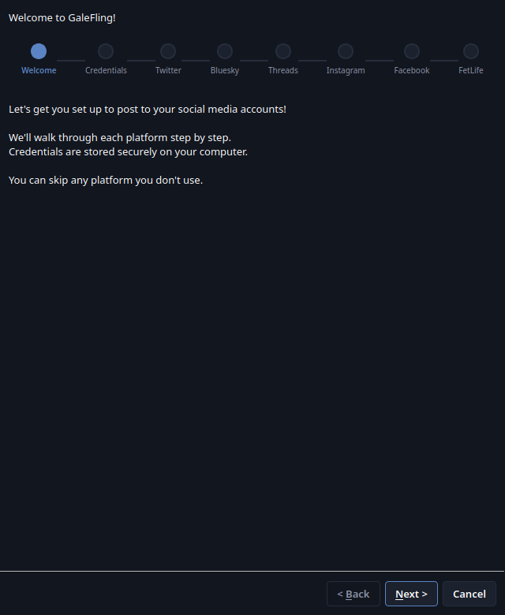
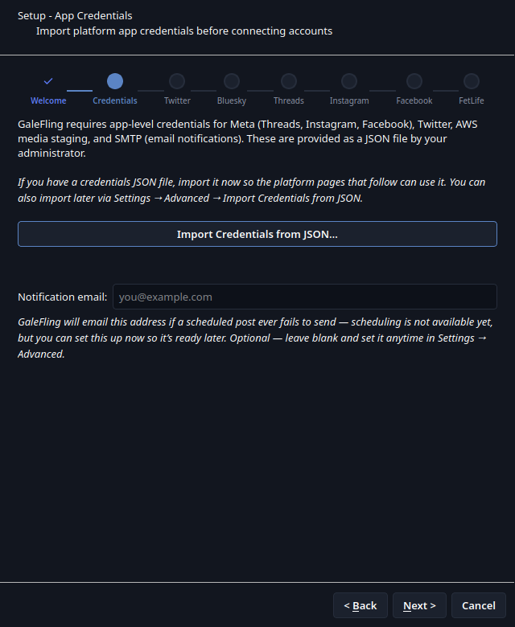
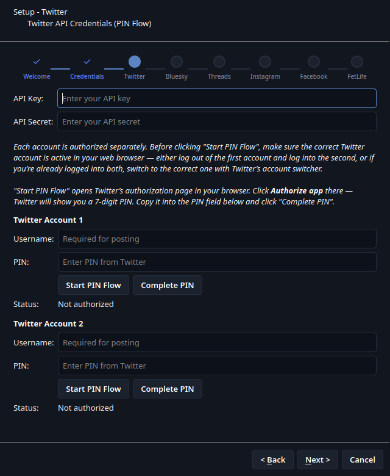
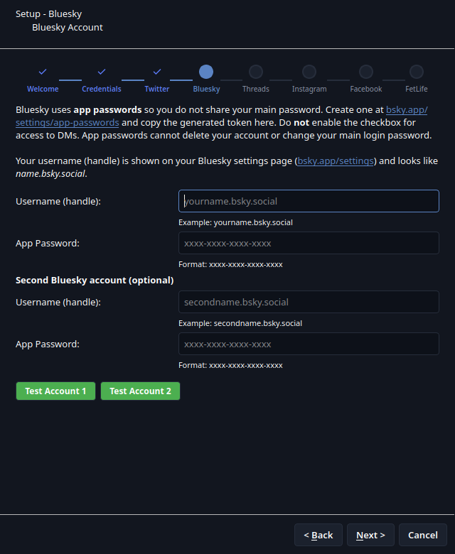
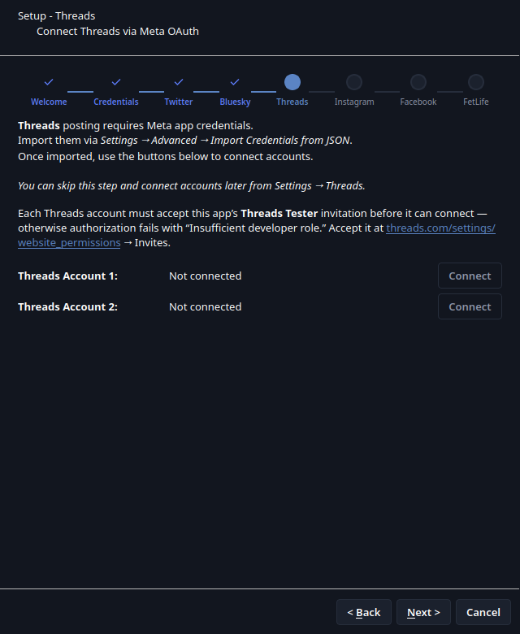
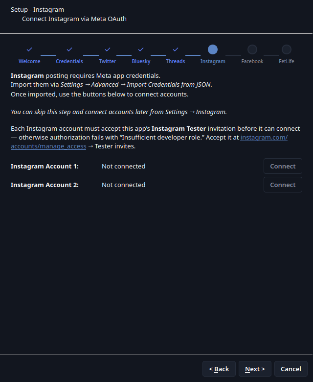
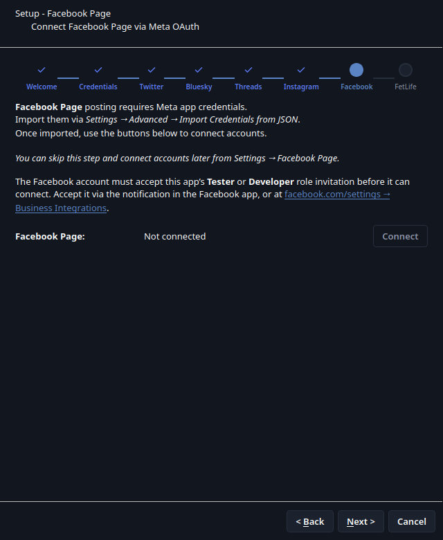
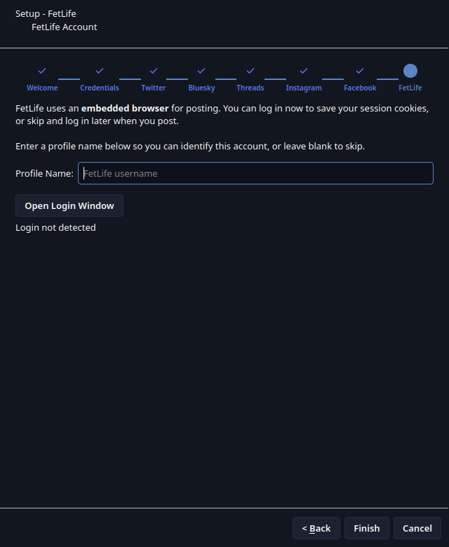

# Setup Wizard Walkthrough

A step-by-step look at GaleFling's first-run setup wizard. Every account
handle, API key placeholder, and status shown below is fake sample data —
this walkthrough is generated offscreen against a throwaway config
directory with no real credentials involved, using
`tools/screenshots/generate_wizard_step_screenshots.py`.

The wizard is skippable at every step — connect only the platforms you
actually use, and revisit any of them later from **Settings**.

## 1. Welcome



## 2. App Credentials

Import the app-level credentials JSON your administrator provides — Meta,
Twitter, AWS media staging, and SMTP all arrive in one file. Also where you
set the address that should receive email notifications, if you want that
ready ahead of when scheduling ships. See
[docs/CREDENTIALS.md](CREDENTIALS.md) for the full format.



## 3. Twitter

Twitter's PIN-flow OAuth: click **Start PIN Flow**, authorize in the browser
tab that opens, copy the 7-digit PIN back in. Supports two accounts.



## 4. Bluesky

App passwords only — never the main account password. Also supports a
second account.



## 5. Threads

Connects via Meta OAuth once the app credentials from step 2 are imported.
Each account must accept this app's Threads Tester invitation first — see
[docs/platforms/META_APPS.md](platforms/META_APPS.md#tester-roles-while-apps-are-in-development).



## 6. Instagram

Same Meta OAuth connect flow as Threads, its own Tester invitation.



## 7. Facebook Page

Also Meta OAuth, but connects a Page rather than a personal profile — see
[docs/platforms/FACEBOOK.md](platforms/FACEBOOK.md).



## 8. FetLife

WebView-based — log in now to save session cookies, or skip and log in
later from the composer.



## Regenerating these screenshots

After a wizard UI change:

```bash
.venv/bin/python tools/screenshots/generate_wizard_step_screenshots.py docs/images/wizard-steps
```

Writes `NN-<step-name>.png` for every page in wizard order, overwriting
this directory. Offscreen-rendered against a throwaway temp `HOME`, so it
never touches real config or credentials.
