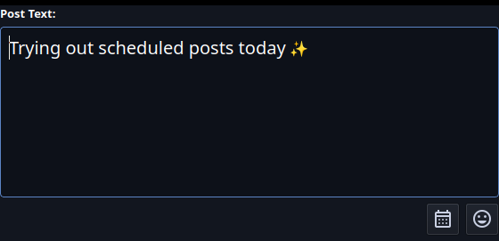
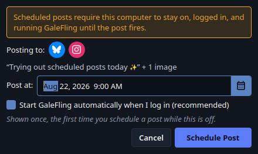
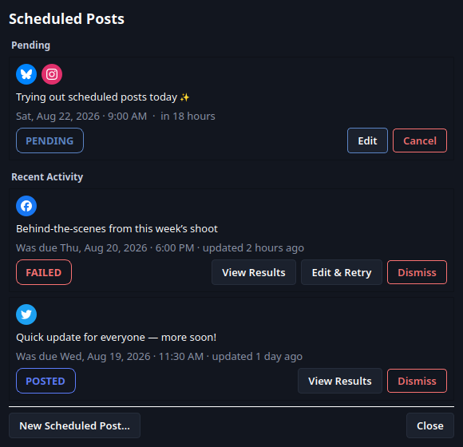
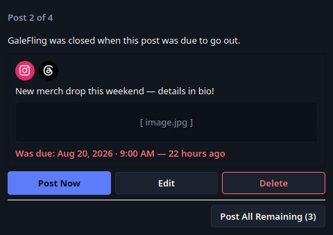
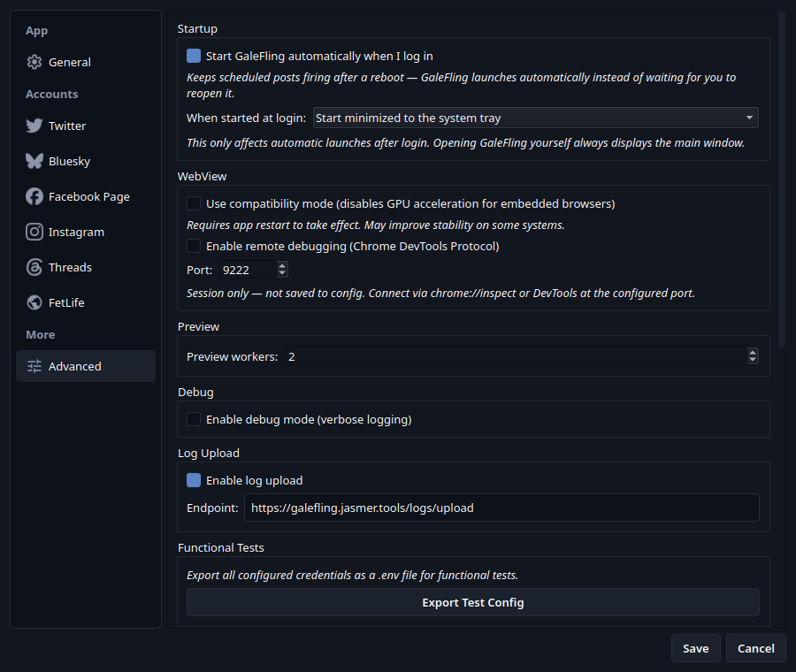
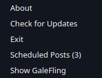

# GaleFling — Scheduling UI Design

## Status

**Draft — design only, no implementation yet.** Companion to
[docs/plans/SCHEDULING.md](SCHEDULING.md), which owns the scheduling-mechanism
decisions (local queue for every schedulable platform, R2/R4, email notifications,
shutdown awareness, start-at-login). This document owns the screens: what Rin
actually sees and clicks through for each of those decisions, with mockups.

Tracked in Odoo **#450**, same as `SCHEDULING.md`.

Canonical repo path: `docs/plans/SCHEDULING_UI_DESIGN.md`

---

## How these mockups were made

Scheduling is Phase 1 work — nothing here exists in code yet, so these are not
screenshots of real behavior. They're built by
`tools/screenshots/generate_scheduling_mockups.py`, a standalone script that
constructs the screens below out of plain Qt widgets (not production classes,
since none exist) but styled with the app's real theme and tokens
(`src/utils/theme.py`, `src/utils/tokens.py`) and real platform/UI icon assets
(`src/resources/icons/`), the same way
`tools/screenshots/generate_readme_screenshots.py` renders the README's
screenshots — offscreen, fake data only, isolated scratch `HOME`. Two
mockups go a step further and inject their new control into a real, running
production widget instead of a from-scratch replica, so they sit next to
controls that exist today: the [Schedule dialog](#1-schedule-dialog)'s
composer calendar icon (real `PostComposer`) and
[Startup settings](#4-startup-settings-settings--advanced) (real
`SettingsDialog`).

Re-run after this document's design changes:

```bash
.venv/bin/python tools/screenshots/generate_scheduling_mockups.py
```

---

## Screen inventory

| # | Screen | Satisfies | New or existing surface |
|---|--------|-----------|--------------------------|
| 1 | [Schedule dialog](#1-schedule-dialog) | R2 (schedule a post) | New — opened via a new calendar icon button in the composer, beside the emoji picker |
| 2 | [Scheduled Posts queue](#2-scheduled-posts-queue) | R2 (see/edit/cancel pending) | New — opened from a new menu bar entry |
| 3 | [Missed Scheduled Posts reconciliation](#3-missed-scheduled-posts-reconciliation) | R4 (startup reconciliation) | New — modal, shown on launch when applicable |
| 4 | [Startup settings](#4-startup-settings-settings--advanced) | R4 (start-at-login mitigation) | Extends existing `SettingsDialog` → Advanced |
| 5 | [Tray context menu](#5-tray-context-menu) | R4 (background/tray operation) | New — requires tray support, which doesn't exist yet either |

Not mocked, and explained instead of drawn — see
[Deliberately not mocked](#deliberately-not-mocked).

---

## 1. Schedule dialog



Opened by a new calendar icon button in the composer itself
(`src/gui/post_composer.py`), not a separate button in `main_window.py`'s
button row. Placed immediately to the left of the existing emoji picker
button, in the same `emoji_row` (`post_composer.py:305-313`) — a
`QToolButton` matching `EmojiPickerButton`'s tooltip convention
(`'Schedule this post for a later time'`, next to `EmojiPickerButton`'s
`'Insert emoji'`). Clicking it opens the dialog below.

**Both icons enlarged to 30×30 (Jas).** Up from `EmojiPickerButton`'s
current 20×20 (`emoji_picker.py`) — a real change to the existing emoji
button, not just a size picked for the new calendar icon, so both read at
the same, slightly more prominent scale. Implementation should bump
`EmojiPickerButton.__init__`'s `setIconSize(QSize(20, 20))` alongside
adding the calendar button, not leave the two mismatched.

**Icon note:** the mockup's calendar glyph is hand-drawn by the mockup
script (`_calendar_icon` in `generate_scheduling_mockups.py`) because no
calendar/event icon exists yet under `src/resources/icons/ui/` — the
existing set (`mood.svg`, `history.svg`, etc.) has nothing that fits.
Implementation should source a real one from the same Material Symbols set
(e.g. `calendar_month` or `event`), not ship the hand-drawn approximation.



Contents, top to bottom:

- **Persistent warning banner** (`WARNING` token colors) — always shown, not
  conditional on anything, per
  [SCHEDULING.md's composer-time warning](SCHEDULING.md#shutdown-awareness-r4):
  "Scheduled posts require this computer to stay on, logged in, and running
  GaleFling until the post fires."
- **Target platforms row** — the same account badges the platform selector
  already uses, reflecting whatever's currently selected in
  `PlatformSelector`. Read-only here; changing platforms means closing this
  dialog and using the composer's own selector, not a duplicate control.
- **Caption/media preview** — a single-line summary of the composer's current
  text and media count, muted text color, so Rin can confirm what she's about
  to schedule without the dialog re-rendering the full composer.
- **Post at** — a `QDateTimeEdit` with `setCalendarPopup(True)`. No separate
  date and time fields; one control, matching how the rest of the app avoids
  splitting single concepts across widgets.
- **Start GaleFling automatically when I log in** checkbox, checked by
  default — shown only the first time Rin schedules a post while autostart is
  off, per
  [SCHEDULING.md's Start at login](SCHEDULING.md#start-at-login). Every
  subsequent Schedule dialog omits it once the setting is on.
- **Cancel / Schedule Post** — Schedule Post uses the same primary button
  style as Post Now. Once clicked, it: (a) writes a `pending` row to the
  local queue, (b) turns on the start-at-login setting if the checkbox was
  shown and checked, (c) closes the dialog, (d) **clears the composer**, the
  same as a fully successful `Post Now` does (`main_window.py`'s
  `_on_api_post_finished`: `_clear_draft()`, `_composer.clear()`,
  `_cleanup_processed_media()`, `_clear_format_restriction()`) — scheduling
  is a completed action for this composer session, not a pending one — and
  (e) shows a **toast** confirming the post was scheduled, not the full
  `ResultsDialog`, since nothing was actually posted yet.

**Validation not shown in the mockup:** the due-time picker rejects anything
less than [5 minutes from now](SCHEDULING.md#local-queue) — see
`SCHEDULING.md` for the mechanism-level decision; this dialog is just where
Rin encounters it.

---

## 2. Scheduled Posts queue



Opened via a new top-level **Scheduled** menu in `main_window.py`'s
`_create_menu_bar` (`main_window.py:559-623`), alongside File/Settings/Help,
with a single action **View Scheduled Posts…**. Per AGENTS.md rule 6, its
handler logs `User selected Scheduled > View Scheduled Posts...`, the same
`log_and_call` pattern every other menu action already uses.

This is R2's queue-management requirement, satisfied directly: every pending
item, visible in one place, editable or cancellable without waiting for its
due time.

Each row (styled like `ResultsDialog`'s per-result `QFrame` rows in
`results_dialog.py`):

- **Platform badge(s)** — one circular badge per target platform, reusing
  `_build_result_badge`'s visual language (brand icon over the platform's
  brand color) without its success/failure status dot, since nothing has
  fired yet.
- **Caption preview**, truncated with an ellipsis if long, plus **due
  date/time and a relative label** ("in 18 hours", "in 2 days") — both,
  not one or the other, so Rin can read whichever is more useful at a
  glance.
- **Pending status pill** — `ACCENT` token color. `failed` items don't
  appear here; a failed scheduled post is a R4 notification event (email +
  system toast + GUI failure state), not a queue-management concern, and a
  `posted` item leaves the queue entirely once it fires.
- **Edit** — reopens the composer pre-filled with this item's text, media,
  platforms, and due time, the same composer instance/pattern the
  [reconciliation dialog's Edit](#3-missed-scheduled-posts-reconciliation)
  action uses.
- **Cancel** — removes the item from the queue outright. Styled with the
  `DANGER` token as an outline (not a filled danger button), consistent with
  how the app already treats destructive-but-recoverable actions
  (`_reset_configuration`'s confirmation, not the button styling itself,
  is the actual safeguard — Cancel here should get the same "are you sure"
  confirmation before removing an item with real content in it).

Footer: **New Scheduled Post…** (equivalent to closing this dialog and
clicking the composer's calendar icon, offered here too since Rin might
open this dialog first) and **Close**.

**Empty state, not mocked as a separate image, described here instead:** when
`_QUEUE_ITEMS` is empty, the dialog shows a single centered message ("No posts
scheduled") and only the New Scheduled Post… / Close buttons — not an empty
list with just a header, which would look broken rather than intentional.

---

## 3. Missed Scheduled Posts reconciliation



Modal, shown on launch per
[SCHEDULING.md's startup reconciliation](SCHEDULING.md#not-failing-silently-r4),
**only when at least one pending item's due time has passed.** One window for
every missed item, stepping to the next after each decision — not one popup
per item.

- **"Post N of M"** progress label, plain text (no progress bar — a count is
  enough for what's realistically a handful of items).
- **Item preview card**: target platform badges, caption, a media placeholder
  (dashed border, `SURFACE_INSET` background — actual thumbnail rendering is
  an implementation detail this mockup doesn't need to solve), and a
  **"Was due: `<date>` — `<relative>` ago"** line in `DANGER` red, so the
  staleness is visually unmistakable before Rin decides.
- **Post Now / Edit / Delete** — the three choices
  [SCHEDULING.md settled on](SCHEDULING.md#not-failing-silently-r4), left to
  right in that order (least destructive first is the usual convention, but
  here "Post Now" is the default/likely action, so it leads). Edit reopens
  the composer exactly like [the queue's Edit](#2-scheduled-posts-queue).
  Whichever is chosen, the window advances to the next missed item, or closes
  if this was the last one.
- **Post All Remaining (N)** — footer, separated by a divider, per
  [SCHEDULING.md's bulk action](SCHEDULING.md#not-failing-silently-r4). Only
  appears when more than one item remains. No equivalent bulk Delete or Edit.

**Resolved (Jas): closing the window (titlebar X) without deciding on every
item leaves undecided items pending in the queue, and the reconciliation
window asks again on the next launch.** Nothing is lost or auto-resolved by
default — an unreviewed item stays exactly as pending as it was before
launch, just with a due time now in the past, until Rin either decides on it
here or edits/cancels it directly from the
[Scheduled Posts queue](#2-scheduled-posts-queue).

---

## 4. Startup settings (Settings → Advanced)



A new **Startup** `QGroupBox`, styled and structured exactly like every
other section in `settings_dialog.py`'s `_create_advanced_tab`
(`settings_dialog.py:915-1097`) — compare to the existing `WebView`, `Debug`,
and `Email Notifications` groups it sits alongside. Placed first, above
`WebView`, since it's the most consequential toggle on the page once
scheduling exists (nothing else in Advanced determines whether a scheduled
post fires at all).

- **Checkbox**: "Start GaleFling automatically when I log in."
- **Hint text** (italic, muted, matching every other group's hint label
  convention): "Keeps scheduled posts firing after a reboot — GaleFling
  launches automatically instead of waiting for you to reopen it." Corrected
  (Jas) from an earlier
  draft's "required... while you're away from the computer" — the setting
  isn't about presence at all (a post fires whether or not Rin is at the
  machine, as long as GaleFling is running); it's specifically about
  surviving a reboot, per
  [SCHEDULING.md's Start at login](SCHEDULING.md#start-at-login): "the
  machine can be on and Rin logged in, with GaleFling simply never launched
  since the last boot."
- **Automatic launch mode**: a selector labeled "When started automatically:"
  with two explicit choices: **Open the main window** and **Start minimized to
  the system tray**. The tray choice is the default. This setting applies only
  to a login/autostart launch; opening GaleFling manually continues to show the
  normal window. The selector stays configurable while autostart is off so Rin
  can choose the behavior before enabling it.

This is the durable, always-available control. The
[Schedule dialog's inline checkbox](#1-schedule-dialog) is the proactive
one-time prompt; enabling autostart there uses the saved automatic-launch
mode (the tray default if it has never been changed). This Settings group is
where Rin turns autostart back off or changes how an automatic launch appears.

---

## 5. Tray context menu



GaleFling has no system tray presence today — this is new surface required by
[SCHEDULING.md's background/tray operation](SCHEDULING.md#phase-1--scheduler-in-the-desktop-app-23-weeks)
and [Start at login's configurable launch mode](SCHEDULING.md#start-at-login),
not something this document invents independently.

Menu, top to bottom: **Show GaleFling** (restores the main window), a
separator, **Scheduled Posts (N)** (opens the
[queue dialog](#2-scheduled-posts-queue) directly — the count updates live as
items are added/fire/cancelled), a separator, **Check for Updates** and
**About** (the same actions as `main_window.py`'s `Help` menu, reused rather
than reimplemented — see
[Component / file mapping](#component--file-mapping)), a separator, **Exit**.
`QSystemTrayIcon` using the existing app icon (`resources/icon.ico`); no new
icon asset needed.

Check for Updates and About matter here specifically because the main window
may not be visible — Rin could be running for days with GaleFling minimized
to the tray (when that [startup mode](#4-startup-settings-settings--advanced) is selected),
so the tray menu is the only reachable surface for them at that point, not a
convenience duplicate of the Help menu.

Per AGENTS.md rule 6, each tray menu action logs
`User selected Tray > <Action>` on trigger, the same convention every other
menu action in the app already follows.

---

## Deliberately not mocked

- **Windows shutdown-block dialog** ([SCHEDULING.md](SCHEDULING.md#shutdown-awareness-r4))
  — **deferred out of Phase 1 entirely** (2026-08-22, Jas: "leave out the reboot
  blocking, may revisit in the future"), not merely a native-chrome mockup exclusion.
  Noted here for whoever revisits it: it would have been native Windows chrome
  (`ShutdownBlockReasonCreate`'s "this app is preventing shutdown" dialog) rendered
  by the OS, not by GaleFling, with a single reason string as its only content — no
  layout decision to make even if it comes back.
- **System toast for a failed scheduled post.** This is required alongside
  email, but not mocked because it is OS-rendered chrome rather than a GaleFling
  window. The tray icon calls `QSystemTrayIcon.showMessage` once all platform
  attempts for the scheduled item settle. The title is **Scheduled post
  failed**; the body names the failed platform account(s), and clicking it opens
  the existing results UI with the failure details. Multi-platform failures are
  consolidated into one toast per scheduled item, not one interruption per
  platform. See [SCHEDULING.md](SCHEDULING.md#not-failing-silently-r4).

---

## Component / file mapping

For whoever picks up Phase 1 implementation — where each screen's real
version lands, based on the codebase's existing per-dialog file convention
(`results_dialog.py`, `settings_dialog.py`, `setup_wizard.py`, etc.):

| Screen | New file (proposed) | Touches |
|--------|----------------------|---------|
| Schedule dialog | `src/gui/schedule_dialog.py` | `post_composer.py` (new calendar `QToolButton` in `emoji_row`, a new `schedule_requested` signal following the existing `preview_requested`/`media_changed` pattern), `main_window.py` (connects the signal to open the dialog, reading composer/platform-selector state the same way `_do_post` already does) |
| Scheduled Posts queue | `src/gui/scheduled_posts_dialog.py` | `main_window.py` (`_create_menu_bar`, new `Scheduled` menu) |
| Missed-post reconciliation | `src/gui/reconciliation_dialog.py` | `main_window.py` (shown on startup, after `_check_first_run`) |
| Startup settings | — (extends `_create_advanced_tab`) | `settings_dialog.py`, `config_manager.py` (autostart enabled + automatic-launch display mode), platform-specific autostart module (new — Windows `Run` key / Linux XDG autostart, with the minimized-start argument synchronized to the selected mode, per `SCHEDULING.md`) |
| Tray context menu | `src/gui/tray_icon.py` (new — doesn't exist) | `main_window.py` (`closeEvent`, minimize-to-tray behavior; wires Check for Updates / About to the existing `_manual_update_check`/`_show_about` handlers rather than duplicating them), app entry point |
| Schedule-confirmation toast | `src/gui/toast.py` (new — no toast widget exists in the codebase today; the app's only transient-message precedent is `QStatusBar.showMessage`, e.g. `main_window.py`'s `'Ready'`/`'Opening WebView panel...'`) | `main_window.py` or `schedule_dialog.py`, wherever Schedule Post's success handler lands |
| Scheduled-failure system toast | — (uses `QSystemTrayIcon.showMessage`, not the in-app confirmation-toast widget) | scheduler completion path consolidates failed platform result(s); `tray_icon.py` displays the toast and opens the existing results UI when clicked |

The local queue itself (SQLite-backed, due-time poller) is core/back-end
work, not GUI — out of scope for this document; see
[SCHEDULING.md's Local queue section](SCHEDULING.md#local-queue).

---

## References

- `docs/plans/SCHEDULING.md` — scheduling-mechanism decisions, requirements
  (R2/R4), local queue, email notifications, shutdown awareness, start-at-login
- `docs/plans/MOBILE_LAN_ACCESS.md` — architecture this scheduler runs inside
- `src/utils/tokens.py`, `src/utils/theme.py` — design tokens and QSS these
  mockups (and the real implementation) should use
- `src/gui/results_dialog.py`, `src/gui/settings_dialog.py`,
  `src/gui/main_window.py` — existing patterns these mockups follow
- `tools/screenshots/generate_scheduling_mockups.py` — generates every image
  in this document
- `AGENTS.md` — mandatory agent rules, including rule 6 (menu action logging)

---

## Changelog

| Date | Change |
|------|--------|
| 2026-08-22 | Added an automatic-launch display-mode setting (Jas): **Open the main window** or **Start minimized to the system tray**, defaulting to the tray. It applies only to login/autostart launches; manual launches still open normally. Updated the [Startup settings](#4-startup-settings-settings--advanced) design, component mapping, and `settings-start-at-login.png`. Also confirmed scheduled-post failures use both durable email and a transient system toast: one consolidated `QSystemTrayIcon.showMessage` notification per scheduled item, visible while minimized and opening the existing results UI when clicked. Updated [Deliberately not mocked](#deliberately-not-mocked) and the queue-state description. |
| 2026-08-22 | Corrected the [Start at login](#4-startup-settings-settings--advanced) hint text (Jas): "required... while you're away from the computer" was wrong — the setting isn't about presence, a scheduled post fires either way as long as GaleFling is running. It's specifically for surviving a reboot, so GaleFling relaunches instead of Rin having to notice and reopen it herself. New text: "Keeps scheduled posts firing after a reboot — GaleFling launches automatically instead of waiting for you to reopen it." Regenerated `settings-start-at-login.png`. |
| 2026-08-22 | Enlarged both the composer's calendar and emoji icons to 30×30 (Jas), up from `EmojiPickerButton`'s current 20×20 — a real change to the existing emoji button too, not just the new calendar icon's size. Regenerated `composer-schedule-icon.png`; the mockup script now overrides the real `PostComposer` instance's emoji button icon size before capturing, alongside the new calendar button. |
| 2026-08-22 | Changed the Schedule dialog's entry point (Jas): a calendar icon `QToolButton` in the composer's `emoji_row`, immediately left of the emoji picker, instead of a separate "Schedule…" button in `main_window.py`'s button row. Added `composer-schedule-icon.png`, generated by injecting into the real `PostComposer` (same technique the Settings mockup already used). No calendar/event icon exists in `src/resources/icons/ui/` yet, so the mockup hand-draws one (`_calendar_icon` in the generator script) — flagged as needing a real Material Symbols icon at implementation time. Updated [Screen inventory](#screen-inventory), [Component / file mapping](#component--file-mapping), and the queue's "New Scheduled Post…" footer wording accordingly. |
| 2026-08-22 | Removed the "How these mockups were made" section's `results_dialog.py` badge-rendering bug callout (Jas: already addressed) — it was fixed and merged (#69) shortly after this document's initial draft flagged it, so the standing "flagged, not fixed here" note was stale. The 2026-08-21 changelog entry that first flagged it is left as-is (historical record). |
| 2026-08-22 | Resolved the last two open questions (Jas). Schedule confirmation UX: a toast, plus clearing the composer the same way a fully successful `Post Now` does (`main_window.py`'s `_on_api_post_finished` clear sequence) — added a new `src/gui/toast.py` row to [Component / file mapping](#component--file-mapping) since no toast widget exists in the codebase yet. Minimum lead time: 5 minutes from now — moved the actual decision to `SCHEDULING.md`'s [Local queue](SCHEDULING.md#local-queue) section as the mechanism-level canonical source, since it's a poller constraint rather than a GUI one; this document's [Schedule dialog](#1-schedule-dialog) section now just links to it. The now-empty Open questions section was subsequently removed. |
| 2026-08-22 | Added Check for Updates and About to the [Tray context menu](#5-tray-context-menu) (Jas) — reused from `main_window.py`'s existing `Help` menu handlers rather than duplicated, since they're the only reachable copies of those actions while minimized to tray. Regenerated `tray-context-menu.png`. Also updated [Deliberately not mocked](#deliberately-not-mocked) to reflect the Windows shutdown-block dialog being deferred out of Phase 1 entirely, not just excluded from mockups — see `SCHEDULING.md`'s 2026-08-22 changelog entry. |
| 2026-08-22 | Resolved the reconciliation window's close-without-deciding open question (Jas): closing the window without deciding on every item leaves undecided items pending in the queue, and the window asks again on the next launch — nothing lost or auto-resolved by default. Updated the [Missed Scheduled Posts reconciliation](#3-missed-scheduled-posts-reconciliation) section and dropped the resolved item from Open Questions. |
| 2026-08-21 | Corrected the Schedule dialog's button-color description: `tokens.SUCCESS` is `#5C7CFA`, a blue/indigo, not green, despite the token's name. The mockup image already rendered it correctly; only the prose was wrong. |
| 2026-08-21 | Initial draft (Jas): five mockups (Schedule dialog, Scheduled Posts queue, Missed Scheduled Posts reconciliation, Start at login toggle, Tray context menu) covering R2 and R4's GUI surface, generated via a new `tools/screenshots/generate_scheduling_mockups.py`. Flagged a real rendering bug found while building the queue/reconciliation mockups: `results_dialog.py`'s badge `QFrame` styling corrupts descendant layout under the offscreen Qt platform, already visible in the checked-in `docs/images/results-dialog.png`; worked around here, not fixed (separate task). |
